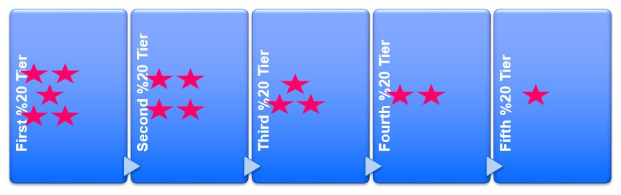

# AHEsegmentation
Segmentation test plsql

* [Segmentasyon nedir](Segmentasyon.md)




[LTV](https://www.bloyal.com/customer-lifetime-value-segmentation/) değerlerine göre azalan sıralı müşteriler, 
LTV'lerinin toplamı bazında beş eşit segmente ayrılıyor.
Yani her segmentin LTV toplamı, toplam LTV değerinin beşte biri oluyor.
Bu durumda en üst segmentte en az kişi, 
en alt segmentte de en fazla kişi sayısı olacak.

Sınırlarda kaçıncı müşteri olduğunu bulmak için
kullanılan PL/SQL kodu:
[BireyselSegmentAylik.sql](BireyselSegmentAylik.sql)

```sql 
v_ILK := 1;  v_SON1 := V_ILK+1;  v_SON2 := SON_MAX;
SONX := FUNC_SONBUL('ELIT       ', v_ILK, v_SON1, v_SON2);
v_ILK := SONX + 1;  v_SON1 := V_ILK+1;  v_SON2 := SON_MAX;
SONX := FUNC_SONBUL('OZEL       ', v_ILK, v_SON1, v_SON2);
v_ILK := SONX + 1;  v_SON1 := V_ILK+1;  v_SON2 := SON_MAX;
SONX := FUNC_SONBUL('STANDART   ', v_ILK, v_SON1, v_SON2);
v_ILK := SONX + 1;  v_SON1 := V_ILK+1;  v_SON2 := SON_MAX;
SONX := FUNC_SONBUL('KITLESEL(A)', v_ILK, v_SON1, v_SON2);
v_ILK := SONX + 1;
DBMS_OUTPUT.put_line ('KITLESEL(B) - ILK: ' || v_ILK || ', SON: ' ||SON_MAX);
```